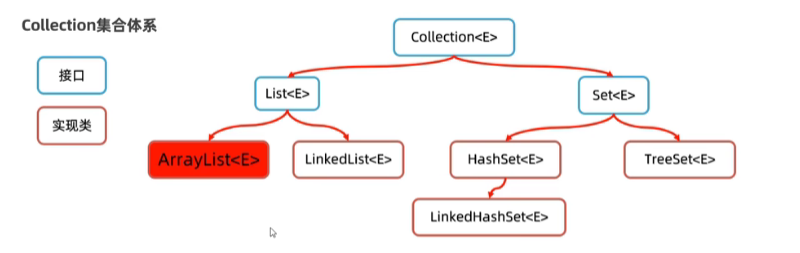

 ##集合

 -接口 Collection<E> { List<E> Set<E> }
    List<E>实现类 
    --有序、可重复、有索引
    1、ArrayList<E>  基于数组结构,查找速度快,增加删除数据比链式慢，比较适合用于修改操作不太多，查询操作比较多的数据
    2、LinkedList<E>  一个链表结构 查找速度慢,增加删除数据块,适用于经常需要修改的数据
    Set<E>实现类
    --无序、不重复、无索引
    1、HashSet<E> ：无序、不重复、无索引
        -LinkHashSet<E> ：有序、不重复、无索引
    2、TreeSet<E> ：按照大小默认升序排序、不重复、无索引
 
 